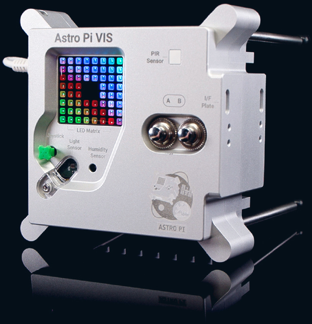
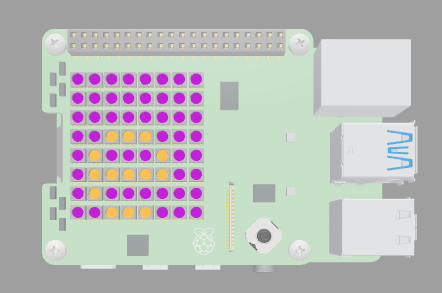

## Introduction

In this project, you will create a personalised rainbow coloured greeting on your Raspberry Pi Sense HAT. 

A **SenseHAT** is an add-on board designed by Raspberry Pi Limited as an environmental sensor and display. There are currently two Raspberry Pi SenseHATs, within the [Astro Pi](https://astro-pi.org/){:target="_blank"} Flight Units, on the International Space Station. Young people all over the world can run their code in space as part of the AstroPi programme!

{:width="300px"}

You will:
+ Scroll a message across an **LED matrix**
+ Change the colour of the **LEDs** to produce a rainbow effect
+ Adjust the **speed** of how the message is displayed

An **LED matrix** is grid of LEDs that can be controlled individually or as a group to create different lighting effects. The LED matrix on the SenseHAT has 64 LEDs displayed in an 8 x 8 grid. The LEDs can be programmed to produce a wide range of colours.

You will need:
+ A web browser for the SenseHAT emulator

[[[rpi-sensehat-emulator]]]

Optional:
+ A Raspberry Pi computer
+ A SenseHAT

[[[rpi-sensehat-attach]]]

--- no-print ---
--- task ---
### Click run and try it!

  
Can you spot the two different ways that text has been displayed in this project?

<iframe src="https://trinket.io/embed/python/5412a2e393?outputOnly=true&runOption=run" width="600" height="600" frameborder="0" marginwidth="0" marginheight="0" allowfullscreen></iframe>

--- /task ---
--- /no-print ---

--- print-only ---

--- /print-only ---