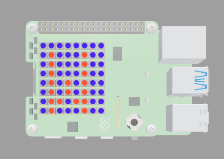
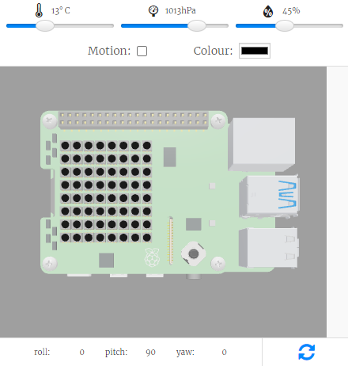

## Create a palette

In this step, you will set up your SenseHAT and create a colour palette for your rainbow message. 

{:width="300px"}

### Set up the SenseHAT

--- task ---

Open the [rainbow message starter project](https://trinket.io/html/bcf1978d5a){:target="_blank"}.

--- /task ---

The SenseHAT uses a **library** of code that needs to be imported into your program. 

**Libraries** are code blocks that have been made to perform a group of tasks for a particular purpose. They allow programmers to share common programming solutions. The SenseHAT library has modules of code that allow programmers to interact with the sensors and the LED matrix on the SenseHAT.

--- task ---

On line 3, enter the code `from sense_hat import SenseHat`. This will import the code from the `sense_hat` library.

--- code ---
---
language: python
filename: main.py
line_numbers: true
line_number_start: 1
line_highlights: 3
---
# Import the libraries

from sense_hat import SenseHat

# Set up the SenseHAT

--- /code ---

--- /task ---

--- task ---

On line 7, enter the code `sense = SenseHat()`. This will set up your SenseHat.

--- code ---
---
language: python
filename: main.py
line_numbers: true
line_number_start: 1
line_highlights: 7
---
# Import the libraries

from sense_hat import SenseHat

# Set up the SenseHAT

sense = SenseHat()

# Rainbow colours
--- /code ---

--- /task ---

--- task ---

**Test** your code by clicking on **Run**. You should see the SenseHAT emulator on the right hand side. 

{:width="300px"}

**Tip**: If you are using a physical SenseHAT then this step isn't needed. 

--- /task ---

### Set up your colour palette

You can use **variables** to store the RGB values for the colours that you wish to use in your project. A **variable** is a name given to a piece of data in your program. The data held under that variable name can change throughout the running of the code. 

--- task ---

Find the comment `# Rainbow colours` in your code. 

Enter the variable names and RGB values for each colour of the rainbow. 

--- code ---
---
language: python
filename: main.py
line_numbers: true
line_number_start: 9
line_highlights: 11-17
---
# Rainbow colours

red = (255, 0, 0)
orange = (255, 69, 0)
yellow = (255, 255, 0)
green = (0, 255, 0)
blue = (0, 0, 255)
indigo = (75, 0, 130)
violet = (238, 130, 238)

# Welcome in rainbow colours
--- /code ---

--- /task ---

[[[generic-theory-simple-colours]]]

### Display a single character

Your rainbow message is going to start with the word `Welcome`. You are now going to display the first letter of this word to test your colour palette.

--- task ---

Find the comment `# Welcome in rainbow colours` in your code.

Enter the code `sense.show_letter("W", red, blue)` to display the letter `W` using red text and a blue background.

--- code ---
---
language: python
filename: main.py
line_numbers: true
line_number_start: 20
line_highlights: 22
---
# Welcome in rainbow colours

sense.show_letter("W", red, blue) # Display the letter W with red text and a blue background
--- /code ---

--- /task ---

--- task ---

**Test** your code by clicking on the **Run** button. You should see a letter `W` with red text and a blue background. 

{:width="300px"}

--- /task ---

