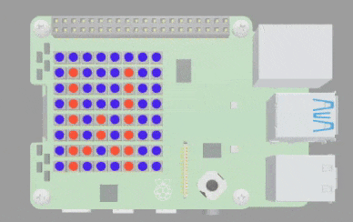
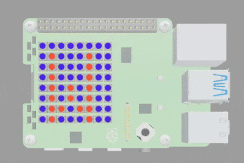

## Display characters

In this step, you will display the other characters in the word `Welcome` using different rainbow colours. 

{:width="300px"}

### Using the `sleep()` function

The `Welcome` letters need to appear one by one with a short delay to allow you to read the letter on the screen. 

The `time` library has a useful piece of code called `sleep` that allows you to pause the code for a set amount of time.

--- task ---

Find the comment `# Import the libraries`.

Enter the code `from time import sleep` to import sleep from the time library.

**Tip:** Press the enter key at the end of the line above to make space for your new line of code.

--- code ---
---
language: python
filename: main.py
line_numbers: true
line_number_start: 1
line_highlights: 4
---
# Import the libraries

from sense_hat import SenseHat
from time import sleep
--- /code ---

--- /task ---

To call the sleep function in your code you use `sleep(1)`. The number inside the brackets is the number of seconds that you want to pause the code for. 

--- task ---

Find the code that displays the letter `W` on your SenseHAT. 

Underneath, enter the code `sleep(1)`.

--- code ---
---
language: python
filename: main.py
line_numbers: true
line_number_start: 20
line_highlights: 23
---
# Welcome in rainbow colours

sense.show_letter("W", red, blue) # Display the letter W with red text and a blue background
sleep(1) # Pause the code for 1 second

# Scroll message settings
--- /code ---

--- /task ---

### Add the rest of the message

--- task ---

Under your `sleep(1)` line of code, add the line `sense.show_letter("e", orange, indigo)`.

--- code ---
---
language: python
filename: main.py
line_numbers: true
line_number_start: 20
line_highlights: 24
---
# Welcome in rainbow colours

sense.show_letter("W", red, blue) # Display the letter W with red text and a blue background
sleep(1) # Pause the code for 1 second
sense.show_letter("e", orange, indigo)

# Scroll message settings
--- /code ---

--- /task ---

--- task ---

**Test** your code by clicking on the **Run** button. You should see the letter `W` appear, followed by the letter `e` 1 second later.

{:width="300px"}

--- /task ---

--- task ---

Repeat the same code for each letter of the `Welcome` message. Remember to change the letter and the colours used for the text and the background.

--- code ---
---
language: python
filename: main.py
line_numbers: true
line_number_start: 20
line_highlights: 25-35
---
# Welcome in rainbow colours

sense.show_letter("W", red, blue) # Display the letter W with red text and a blue background
sleep(1) # Pause the code for 1 second
sense.show_letter("e", orange, indigo)
sleep(1)
sense.show_letter("l", yellow, green)
sleep(1)
sense.show_letter("c", green, yellow)
sleep(1)
sense.show_letter("o", blue, red)
sleep(1)
sense.show_letter("m", indigo, orange)
sleep(1)
sense.show_letter("e", violet, red)
sleep(1)
--- /code ---

--- /task ---

--- task ---

**Test** your code by clicking on the **Run** button. You should see each letter of the word `Welcome` appearing on the LED matrix. 

{:width="300px"}

--- /task ---

--- task ---

**Choose**: You can choose different colours from the rainbow colour palette for the text and background colour of each letter. 

For example, for the letter `e` you could change the colours from `violet` and `red` to `indigo` and `blue`.

**Before:**

--- code ---
---
language: python
filename: main.py
line_numbers: false
line_number_start: 
line_highlights: 
---
sense.show_letter("e", violet, red)
--- /code ---

**After:**

--- code ---
---
language: python
filename: main.py
line_numbers: false
line_number_start: 
line_highlights: 
---
sense.show_letter("e", indigo, blue)
--- /code ---

--- /task ---

