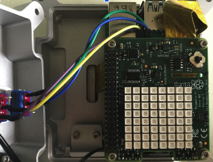

## Scroll a message

In this step, you will use the scrolling function to scroll your name across the LED matrix. You will also rotate the message so that it can be adjusted if your SenseHAT isn't in the default position. 

{:width="300px"}

The SenseHAT library has a function that you can use to **scroll a message** across the screen. 

### Display your scrolling message

--- task ---

Find the comment `# Scroll message`.

Create a variable called `message` to store your name. We will use the name **Babbage** `message = 'Babbage'`

--- code ---
---
language: python
filename: main.py
line_numbers: true
line_number_start: 37
line_highlights: 39
---
# Scroll message

message = 'Babbage'
--- /code ---

**Tip**: You can choose to enter your own name or use `Babbage`. 

--- /task ---

--- task ---

Underneath your `message = 'Babbage'` code, enter `sense.show_message(message) # Scroll the message`.

--- code ---
---
language: python
filename: main.py
line_numbers: true
line_number_start: 37
line_highlights: 40
---
# Scroll message

message = 'Babbage'
sense.show_message(message) # Scroll the message
--- /code ---

--- /task ---

--- task ---

**Test** your code by clicking on **Run**. You should see your original `Welcome` letters followed by a scrolling `Babbage` (or your name).

{:width="300px"}

--- /task ---

--- task ---

Inside `sense.show_message`, add code to control the speed at which your message scrolls. Use the value `0.2` to move the message along every 0.2 seconds.

--- code ---
---
language: python
filename: main.py
line_numbers: true
line_number_start: 37
line_highlights: 40
---
# Scroll message

message = 'Babbage'
sense.show_message(message, 0.2) # Scroll the message
--- /code ---

--- /task ---

--- task ---

**Test** your code by clicking on **Run**. 

**Choose:** Experiment with the scroll speed value to find the speed you like best. A higher number, for example 0.8, will make the message scroll more slowly. A lower number, for example 0.1, will make the message scroll faster.

--- /task ---

--- task ---

The SenseHAT message default colours are white text on a black background. 

**Choose:** Inside `sense.show_message`, add code to set the text and background colours. Choose colours from your rainbow colour palette. 

--- code ---
---
language: python
filename: main.py
line_numbers: true
line_number_start: 37
line_highlights: 40
---
# Scroll message

message = 'Babbage'
sense.show_message(message, 0.2, blue, violet) 
--- /code ---

--- /task ---

--- task ---

**Test** your code by clicking on **Run**. 

--- /task ---

### Rotating the SenseHATs LED display

The SenseHAT LED matrix can be rotated to change the orientation. This is extremely useful if you are using a physical SenseHAT and your project requires that you place the Raspberry Pi computer upside down or on its side. For this situation, you would need to rotate the display so that the text could be read correctly. 

{:width="300px"}

--- task ---

Find the comment `# Set up the SenseHAT`.

Add in the line of code `sense.set_rotation(180)` to rotate the display be 180 degrees.

--- code ---
---
language: python
filename: main.py
line_numbers: true
line_number_start: 6
line_highlights: 9
---
# Set up the SenseHAT

sense = SenseHat()
sense.set_rotation(180)
--- /code ---

--- /task ---

--- task ---

**Test** your code by clicking on **Run**. You should see the same message but it will be rotated 180 degrees. 

{:width="300px"}

--- /task ---

--- task ---

**Try**: If you are using the emulator and your message is now upside down, or if you want to see your message at other rotations, you can change the rotation degrees. Try entering either `0`, `90` or `270` in between the brackets of `sense.set_rotation(180)`. 

--- /task ---

--- save ---