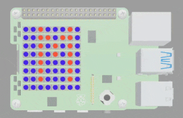
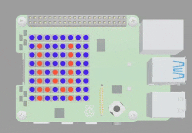

## Scroll a message

In this step, you will use the scrolling function to scroll your name across the LED matrix. You will also rotate the message so that it can be adjusted if your SenseHAT isn't in the default position. 

{:width="300px"}

### Apply the scroll settings

The SenseHAT library has a function that you can use to **scroll a message** across the screen. 

Before you create your scrolling message it is helpful to decide the text colour, background colour and scroll speed that you would like to use. 

--- task ---

Find the comment `# Scroll message settings`.

Add in code for your `text_colour` and `back_colour` to state which colours you would like to use for your scrolling message. 

--- code ---
---
language: python
filename: main.py
line_numbers: true
line_number_start: 37
line_highlights: 39-40
---
# Scroll message settings

text_colour = blue
back_colour = violet
--- /code ---

**Tip**: You can use your rainbow colour palette or you can type the RGB values. This example uses the colour palette variables.

**Tip**: You can pick your own colours from your rainbow colour palette if you want to. 

--- /task ---

--- task ---

Under your `back_colour = violet` line, add in the line `scroll_speed = 0.2`. This will create move the scrolling message along every 0.2 seconds. 

--- code ---
---
language: python
filename: main.py
line_numbers: true
line_number_start: 27
line_highlights: 41
---
# Scroll message settings

text_colour = blue
back_colour = violet
scroll_speed = 0.2
--- /code ---

**Tip**: A higher number, for example 0.8, will make the message scroll more slowly. A lower number, for example 0.1, will make the message scroll faster. 

--- /task ---

### Display your scrolling message

--- task ---

Find the comment `# Scroll message`.

Enter the code `message = 'Babbage'`

--- code ---
---
language: python
filename: main.py
line_numbers: true
line_number_start: 43
line_highlights: 45
---
# Scroll message

message = 'Babbage'
--- /code ---

**Tip**: You can enter your own name instead of `Babbage` if you want to. 

--- /task ---

--- task ---

Underneath your `message = 'Babbage'` code, enter `sense.show_message(message, scroll_speed, text_colour, back_colour) # Scroll the message`.

--- code ---
---
language: python
filename: main.py
line_numbers: true
line_number_start: 43
line_highlights: 46
---
# Scroll message

message = 'Babbage'
sense.show_message(message, scroll_speed, text_colour, back_colour) # Scroll the message
--- /code ---

--- /task ---

--- task ---

**Test** your code by clicking on **Run**. You should see your original `Welcome` message followed by a scrolling `Babbage` (or your name).

{:width="300px"}

--- /task ---

### Rotating the SenseHATs LED display

If you were using a physical SenseHAT then your project might require that you place the Raspberry Pi computer upside down or on its side. For this situation, you would need to rotate the display so that the text could be read correctly. 

<mark>Do we have an image for this that can be used to make it clearer?</mark>

--- task ---

Find the comment `# Set up the SenseHAT`.

Add in the line of code `sense.set_rotation(180)` to rotate the display be 180 degrees.

--- code ---
---
language: python
filename: main.py
line_numbers: true
line_number_start: 6
line_highlights: 9
---
# Set up the SenseHAT

sense = SenseHat()
sense.set_rotation(180)
--- /code ---

--- /task ---

--- task ---

**Test** your code by clicking on **Run**. You should see the same message but it will be rotated 180 degrees. 

{:width="300px"}

--- /task ---

--- task ---

**Try**: Try entering either `0`, `90` or `270` in between the brackets of `sense.set_rotation(180)` to see the different ways your message can be displayed. 

--- /task ---

--- save ---