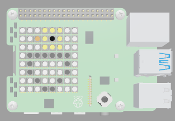

## What next?

If you are following the [Intro to SenseHAT](https://projects.raspberrypi.org/en/raspberrypi/sense-intro) path, you can move on to the [Surprise egg](https://projects.raspberrypi.org/en/projects/surprise-egg) project. In this project, you will make an animation of an egg hatching to reveal a cute pet inside.

--- print-only ---

<mark>To follow</mark>

--- /print-only ---

--- no-print ---

<iframe src="https://trinket.io/embed/python/d58edb5472?outputOnly=true&runOption=run" width="600" height="600" frameborder="0" marginwidth="0" marginheight="0" allowfullscreen></iframe>

--- /no-print ---
